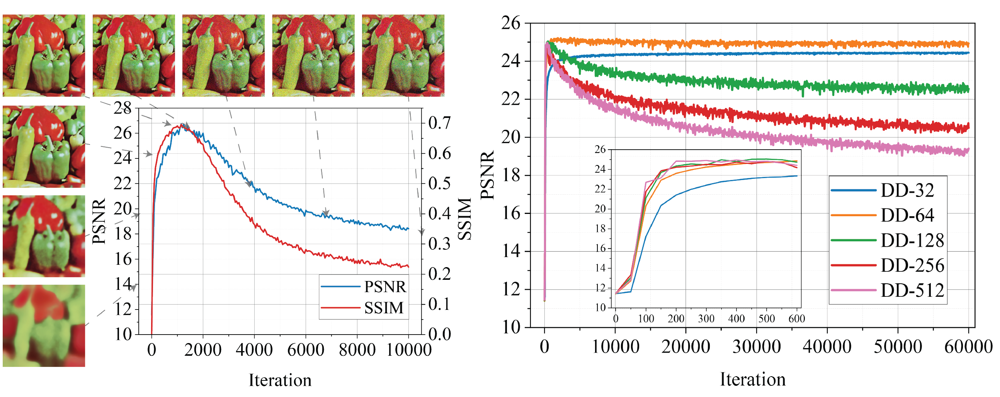
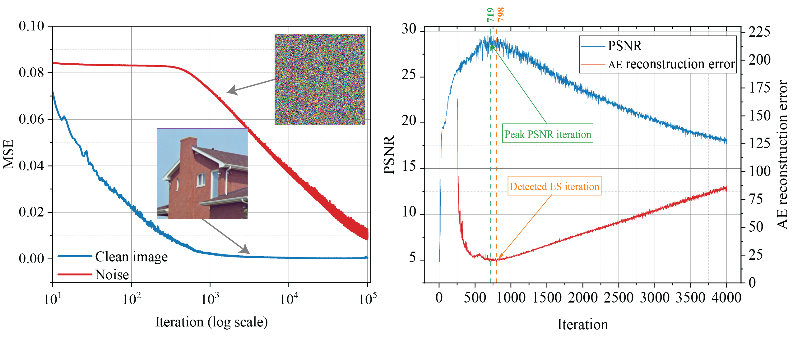
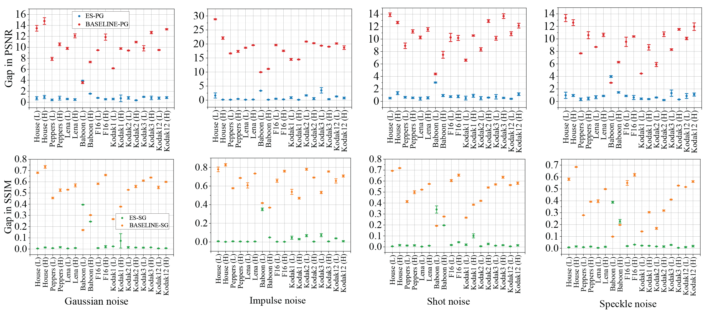
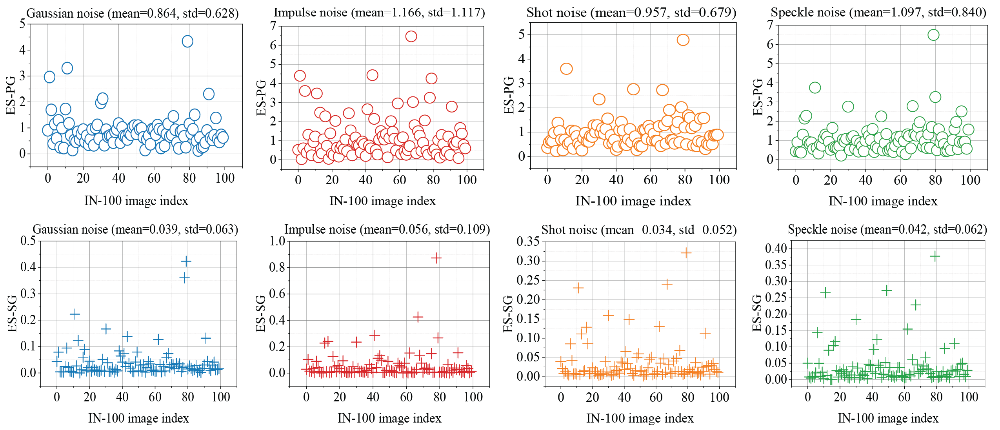
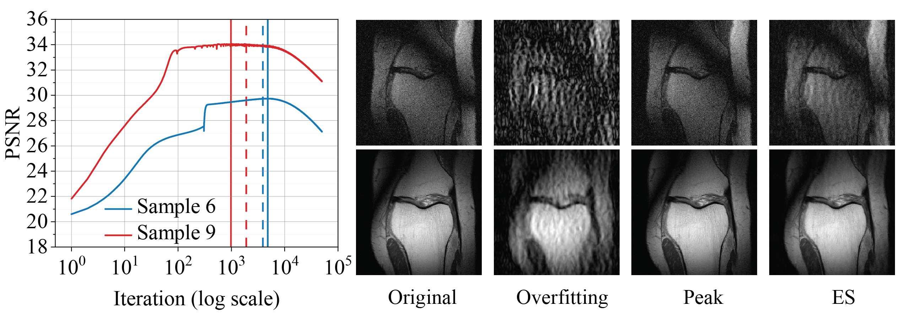
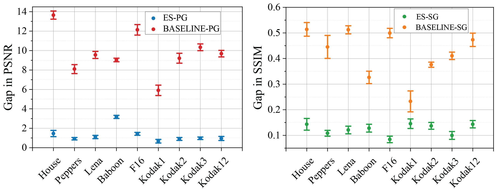

## Early stopping via self-validation

Recent works have shown the surprising effectiveness of deep generative models in solving numerous image reconstruction (IR) tasks, ***without the need for any training set***. We call these models, such as [deep image prior (DIP)](https://ieeexplore.ieee.org/abstract/document/8579082) and [deep decoder (DD)](https://openreview.net/forum?id=rylV-2C9KQ), collectively as ***single-instance deep generative priors*** (SIDGPs). However, often the successes hinge on appropriate early stopping (see [Figure 1](http://)), which by far has largely been handled in an ad hoc manner or even by visual inspection. 

<figure></figure>
  
 <figcaption>Figure 1: Illustration of the overfitting issue of DIP and DD on image denoising with Gaussian noise.</figcaption>

  
 
In this paper, we propose the first principled method for early stopping (ES) when applying SIDGPs to image reconstruction, taking advantage of the typical bell trend of the reconstruction quality. In particular, our method is based on collaborative training and ***self-validation***: the primal reconstruction process is monitored by a deep autoencoder, which is trained online with the historic reconstructed images and used to validate the reconstruction quality constantly. ***On several IR problems and different SIDGPs that we experiment with, our self-validation method is able to reliably detect near-peak performance levels and signal good stopping points*** (see [Figure 2](http://) for an example).

<figure></figure>
  
 <figcaption>Figure 2: (left) The MSE curves of learning a natural image vs learning random noise by DIP; (right) the PSNR curve vs our online AE reconstruction error curve when fitting a noisy image with DIP. The peak of the PSNR curve is well aligned with the valley of the AE error curve. </figcaption>

  

## Image denoising

The power of [DIP](https://ieeexplore.ieee.org/abstract/document/8579082) and [DD](https://openreview.net/forum?id=rylV-2C9KQ) was initially only demonstrated on Gaussian denoising. Here, to make the evaluation more thorough, we also experiment with denoising impulse, shot, and speckle noise, on a [standard image denoising dataset](https://webpages.tuni.fi/foi/GCF-BM3D/index.html#ref_results) (9 images). For each of the 4 noise types, we test a low and a high noise level (details in the Appendix of our paper). To obtain the final degraded
results, we run [DIP](https://ieeexplore.ieee.org/abstract/document/8579082) for 150K iterations. The denoising results are measured in terms of the gap metrics that we define---PSNR gap (PG) and SSIM gap (SG)---are summarized in [Figure 3](http://). 

Our typical detection gap is ≤ 1 measured in ES-PG, and ≤ 0.1 measured in ES-SG. If [DIP](https://ieeexplore.ieee.org/abstract/document/8579082) just runs without ES, the degradation of quality is severe, as indicated by both BASELINE-PG and BASELINE-SG. ***Evidently, our DIP+AE can save the computation and the reconstruction quality, and return an estimate with near-peak performance for almost all images, noise types, and noise levels that we test***. 

<figure></figure>
   
 <figcaption>Figure 3: DIP+AE for image denoising.</figcaption>

  
We further confirm the merit of our method on a larger image dataset consisting of 100 randomly selected images from [ImageNet](https://image-net.org/), denoted as IN-100. We follow the same evaluation protocol as above, except that we only experiment a medium noise level and we do not estimate the means and standard deviations; the results are reported in [Figure 4](http://). ***It is easy to see that the ES-PGs are concentrated around 1 and the ES-GSs are concentrated around 0.1, consistent with our observation on the small-scale dataset above***.

 

<figure></figure>
  
 <figcaption>Figure 4: DIP+AE on IN-100. 1st row: ES-PGs; 2nd row: ES-SGs.</figcaption>

  
 

## MRI reconstruction

We now test our detection method on MRI reconstruction, a classical medical IR problem involving a nontrivial linear f. Specifically, the model is y = f (x) + ξ = F(x) + ξ , where F is the subsampled Fourier operator and ξ models the noise encountered in practical MRI imaging. Here, we take 8-fold undersampling and choose to parametrize x using a [DD](https://openreview.net/forum?id=rylV-2C9KQ). We report the performance here in [Figure 5](http://) (results for all randomly selected samples can be found in the Appendix of our paper). ***Our method is able to signal stopping points that are reasonably close to the peak points, which also yield reasonably faithful reconstruction***.

 

<figure></figure>
  
 <figcaption>Figure 5: Results for MRI reconstruction. (left) The solid vertical lines indicate the peak performance iterate while the dash vertical lines are ES iterate detected by our method. (right) Visualizations for Sample 6 (1st row) and Sample 9 (2nd row).</figcaption>

  

## Image regression

Now we turn to [SIREN](https://proceedings.neurips.cc//paper/2020/hash/53c04118df112c13a8c34b38343b9c10-Abstract.html), a recent functional SIDGP model that is designed to facilitate the learning of functions with significant high-frequency components. We consider a simple task from the original task, image regression, but add in some Gaussian noise. Mathematically, the y = x + ε, where ε∼N (0, 0.196). Clearly, when the MLP used in SIREN is sufficiently overparamterized, the noise will also be learned. We test our detection method on this using the same 9-image dataset as in denoising. From [Figure 6](http://), we can see again that ***our method is capable of reliably detecting near-peak performance measured by either ES-PG or ES-SG, much better than without implementing any ES***.

 

<figure></figure>
  
 <figcaption>Figure 6: Results for image regression.</figcaption>

  
 
## Citation/BibTex

More technical details and experimental results can be found in our paper:

Taihui Li, Zhong Zhuang, Hengyue Liang, Le Peng, Hengkang Wang, Ju Sun. Self-Validation: Early Stopping for Single-Instance Deep Generative Priors. 32nd British Machine Vision Conference 2021.

## Contact
- Taihui Li, lixx5027@umn.edu, [https://taihui.github.io/](https://taihui.github.io/)
- Zhong Zhuang, zhuan143@umn.edu, [https://scholar.google.com/citations?user=rGGxUQEAAAAJ](https://scholar.google.com/citations?user=rGGxUQEAAAAJ)
- Hengyue Liang, liang656@umn.edu, [https://hengyuel.github.io/](https://hengyuel.github.io/)
- Le Peng, peng0347@umn.edu, [https://sites.google.com/view/le-peng/](https://sites.google.com/view/le-peng/)
- Hengkang Wang, wang9881@umn.edu, [https://www.linkedin.com/in/hengkang-henry-wang-a1b293104/](https://www.linkedin.com/in/hengkang-henry-wang-a1b293104/)
- Ju Sun, jusun@umn.edu, [https://sunju.org/](https://sunju.org/)

