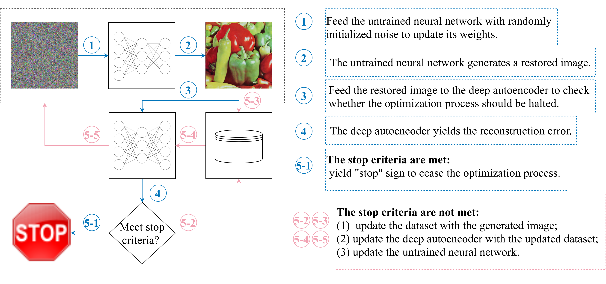

<figure></figure>
  

## Early stopping via self-validation

Recent works have shown the surprising effectiveness of deep generative models in solving numerous image reconstruction (IR) tasks, ***without the need for any training set***. We call these models, such as deep image prior and deep decoder, collectively as ***single-instance deep generative priors*** (SIDGPs). However, often the successes hinge on appropriate early stopping (see [Figure 1](http://)), which by far has largely been handled in an ad hoc manner or even by visual inspection. 

<figure></figure>
  
 <figcaption>Figure 1: Illustration of the overfitting issue of DIP and DD on image denoising with Gaussian noise.</figcaption>

  
 
In this paper, we propose the first principled method for early stopping when applying SIDGPs to image reconstruction, taking advantage of the typical bell trend of the reconstruction quality. In particular, our method is based on collaborative training and ***self-validation***: the primal reconstruction process is monitored by a deep autoencoder, which is trained online with the historic reconstructed images and used to validate the reconstruction quality constantly. On several IR problems and different SIDGPs that we experiment with, our self-validation method is able to reliably detect near-peak performance levels and signal good stopping points (see [Figure 2](http://) for an example).

<figure></figure>
  
 <figcaption>Figure 2: (left) The MSE curves of learning a natural image vs learning random noise by DIP; (right) the PSNR curve vs our online AE reconstruction error curve when fitting a noisy image with DIP. The peak of the PSNR curve is well aligned with the valley of the AE error curve. </figcaption>

  

## Image denoising

<figure></figure>
  
 <figcaption>Figure 3: DIP+AE for image denoising.</figcaption>

  
 
 

<figure></figure>
  
 <figcaption>Figure 4: DIP+AE on IN-100. 1st row: ES-PGs; 2nd row: ES-SGs.</figcaption>

  
 

## MRI reconstruction

 

<figure></figure>
  
 <figcaption>Figure 5: Results for MRI reconstruction. (left) The solid vertical lines indicate the peak performance iterate while the dash vertical lines are ES iterate detected by our method. (right) Visualizations for Sample 6 (1st row) and Sample 9 (2nd row).</figcaption>

  

## Image regression

 

<figure></figure>
  
 <figcaption>Figure 6: Results for image regression.</figcaption>

  

## Citation/BibTex
TBD
